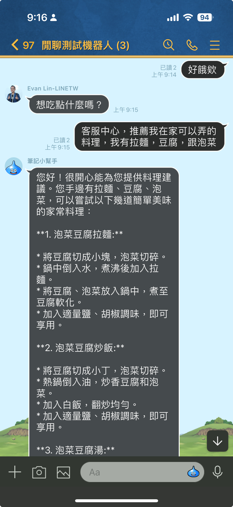
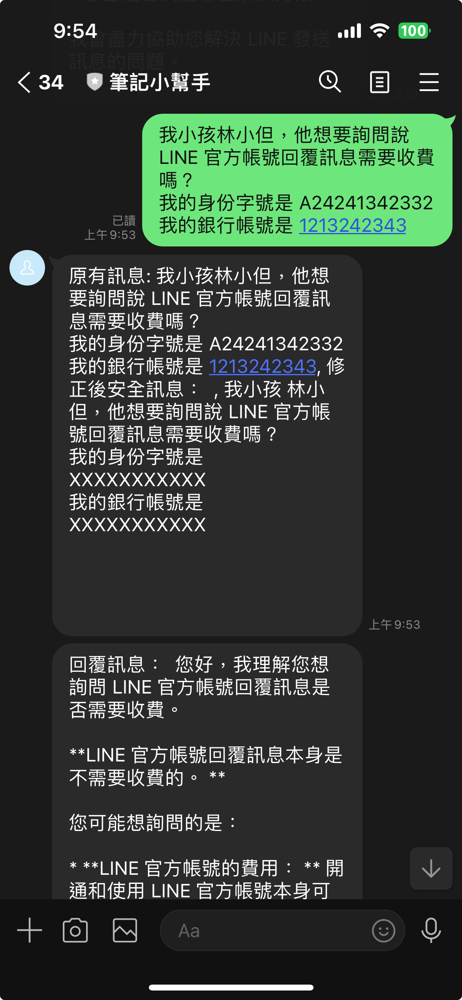

# LINE Bot Demo for Personal Data Hider and LLM Detector

This project provides a FastAPI application that integrates with LINE Bot to hide personal data and detect if customer service assistance is needed using LLM (Large Language Models). The application leverages the Gemini Pro API and Groq for generative AI capabilities.


## Demo Image





## Features

- **Personal Data Hiding**: Automatically removes personal information such as names, addresses, ID numbers, and bank accounts from messages.
- **LLM Assistance Detection**: Detects if a message requires customer service assistance and processes it accordingly.
- **Image Description**: Describes images with scientific detail in Traditional Chinese (zh-TW).

## Environment Variables

Ensure the following environment variables are set:

- `ChannelSecret`: Your LINE Bot channel secret.
- `ChannelAccessToken`: Your LINE Bot channel access token.
- `GEMINI_API_KEY`: Your Gemini Pro API key.
- `GROQ_API_KEY`: Your Groq API key.

## Installation

1. Clone the repository:

    ```sh
    git clone https://github.com/yourusername/your-repo.git
    cd your-repo
    ```

2. Install the required dependencies:

    ```sh
    pip install -r requirements.txt
    ```

3. Set the environment variables:

    ```sh
    export ChannelSecret='your_channel_secret'
    export ChannelAccessToken='your_channel_access_token'
    export GEMINI_API_KEY='your_gemini_api_key'
    export GROQ_API_KEY='your_groq_api_key'
    ```

## Usage

Run the FastAPI application:

```sh
uvicorn main:app --reload

```

## Code Overview

### Main Functionality

- **Message Handling**: The application listens for incoming messages from LINE Bot and processes them based on their type (text or image).
- **Personal Data Removal**: Uses a local LLM to remove personal information from text messages.
- **LLM Assistance Detection**: Determines if a message requires customer service assistance and processes it using the Gemini Pro API.
- **Image Description**: Describes images using the Gemini Pro API.

### Key Functions

- `generate_gemini_text_complete(prompt)`: Generates a text completion using the Gemini Pro API.
- `generate_result_from_image(img, prompt)`: Generates a description for an image using the Gemini Pro API.
- `generate_local_llm_result(prompt)`: Generates a result using a local LLM (Groq).

## Example

Here is an example of how the application processes a text message:

1. A user sends a message containing personal information.
2. The application uses the local LLM to remove personal information.
3. The modified message is then processed by the Gemini Pro API to generate a complete response in Traditional Chinese (zh-TW).
4. The original and modified messages are sent back to the user.

## Contributing

Feel free to submit issues or pull requests if you have any improvements or bug fixes.

## License

This project is licensed under the MIT License.

```

This `README.md` provides an overview of the project, its features, installation instructions, usage, and a brief explanation of the code. Adjust the repository URL and other details as necessary.
